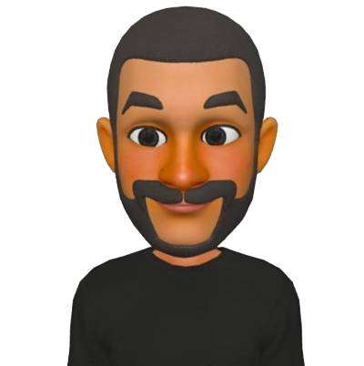

# Lab-02 & Lab-03 & lab-04

## Project Name: About Me

This project give a brief intoduction about me, my role, my skills and my projects.

+ In lab-02 I created the structure of the HTML page and add CSS styling and on the JS I prompt the user with 5 y/n questions and display a replay message.
+ In lab-03 I updated my HTML content and I created 6th and 7th questions in JS by using loops and arrays.
+ In lab-04 We updated the javascript code and we added functions to the questions and we worked as pairs.

## Author: 
+ Ibrahim Aldereni as a Navigator
+ Haya Balasmeh as a Driver

## Links:
[My linkedIn profile](https://www.linkedin.com/in/ibrahim-aldereni/)
